### GIT BRANCHING AND MERGING

## 1. Initial Repository Setup
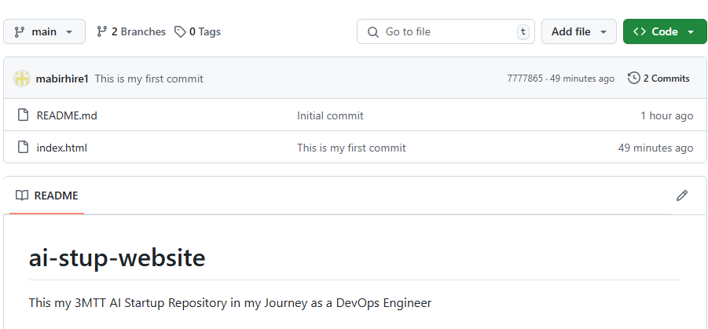

## 2. Create Branches for Team members 
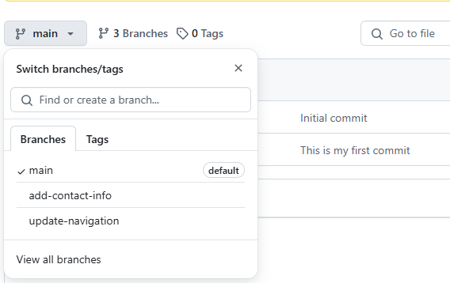

## 3. Initiate Pull Request for Tom's Branch
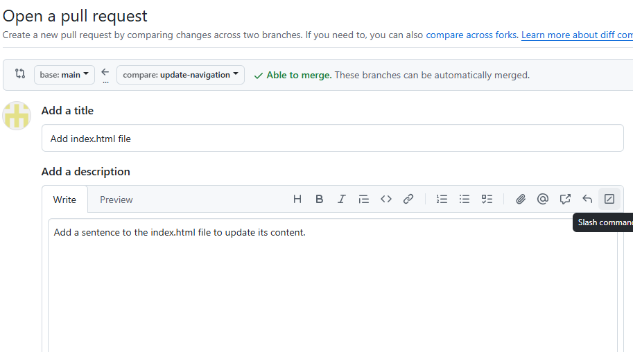

## 4. Create Pull Request for Tom's Branch 
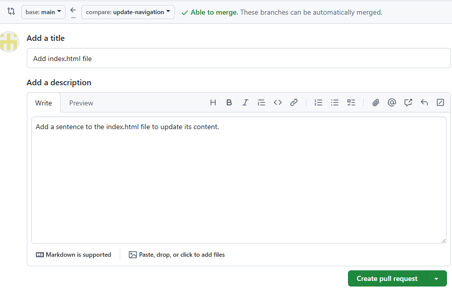

## 5. Review PR
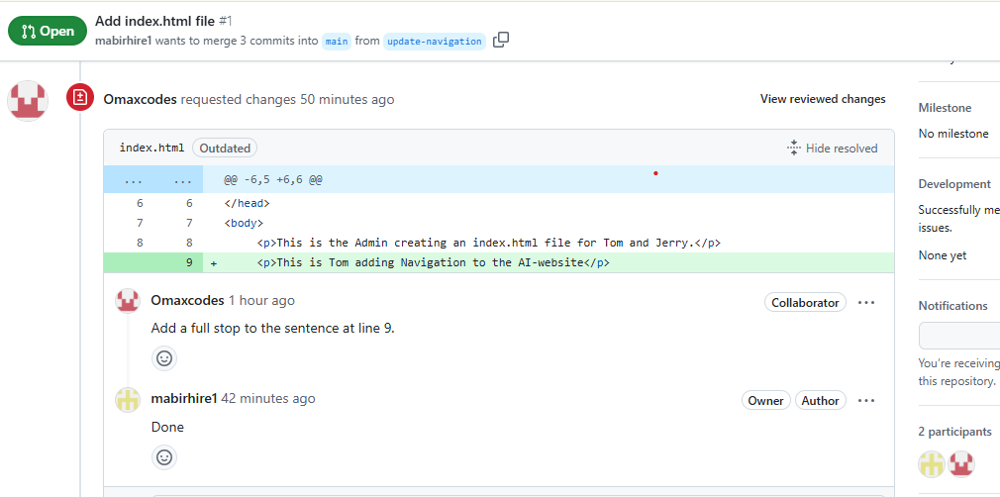

## 6. Make Requested Changes
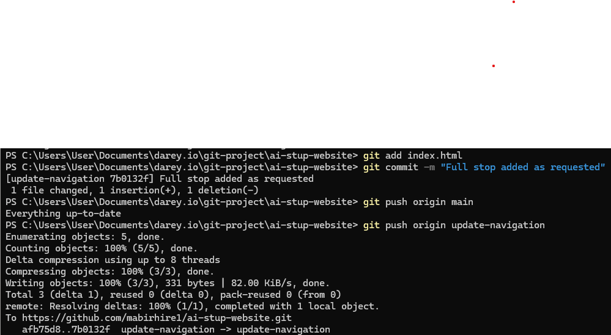

## 7. Approve and Merge the PR on GitHub
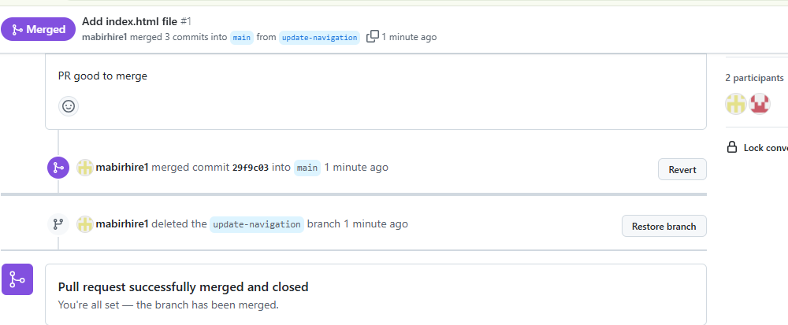

## 8. Update Local Main
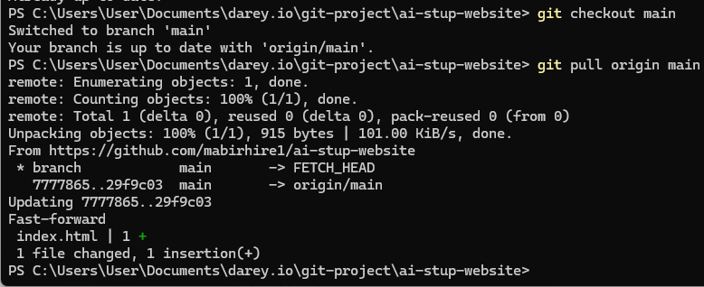

## 9. Conflict Resolution
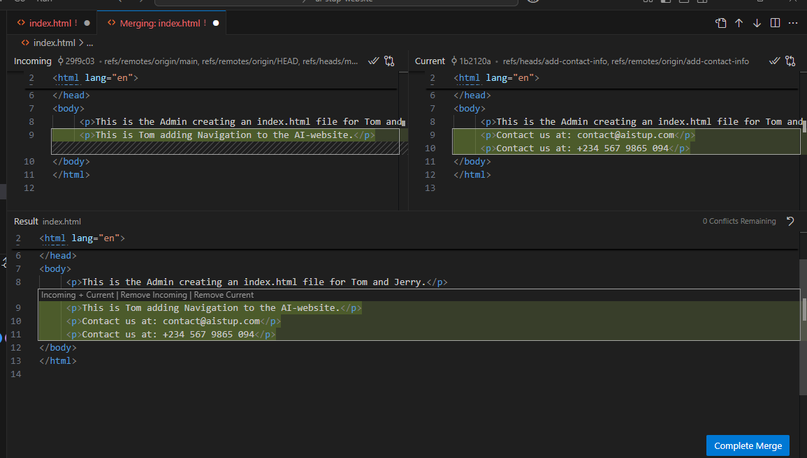

## 10. Synchronizing Jerry's Branch with Main
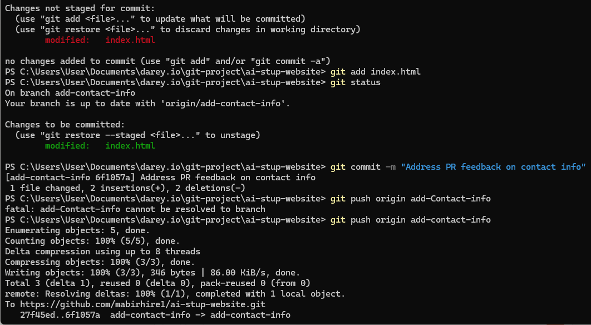

## 11. Create PR for Jerry's Branch on GitHub
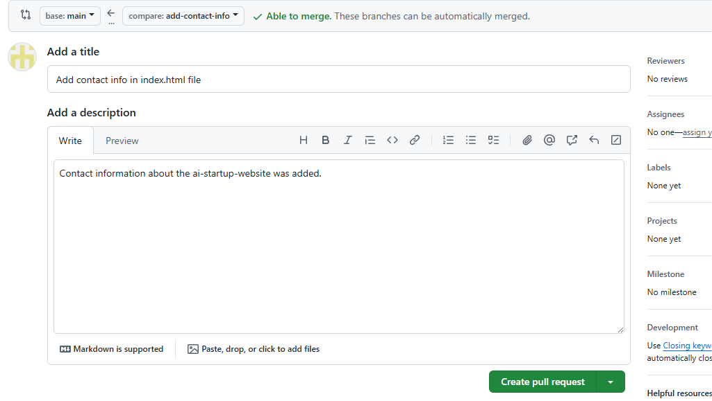

## 12. Add Review Comments
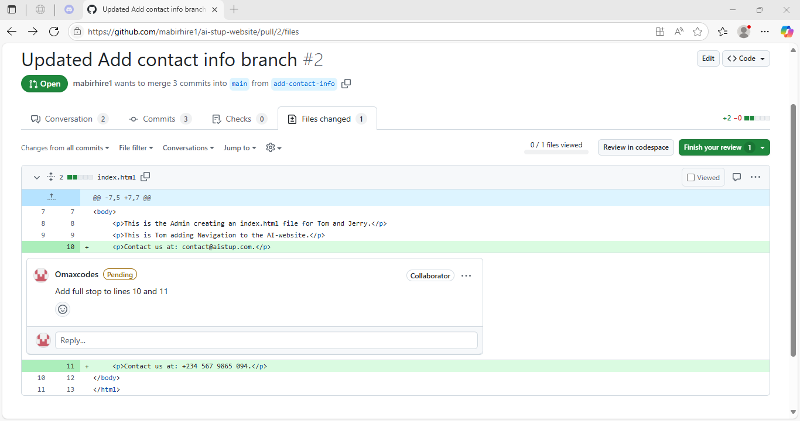

## 13. Address PR Feedback in Jerry's Branch

## 14. Approve and Merge Jerry's PR
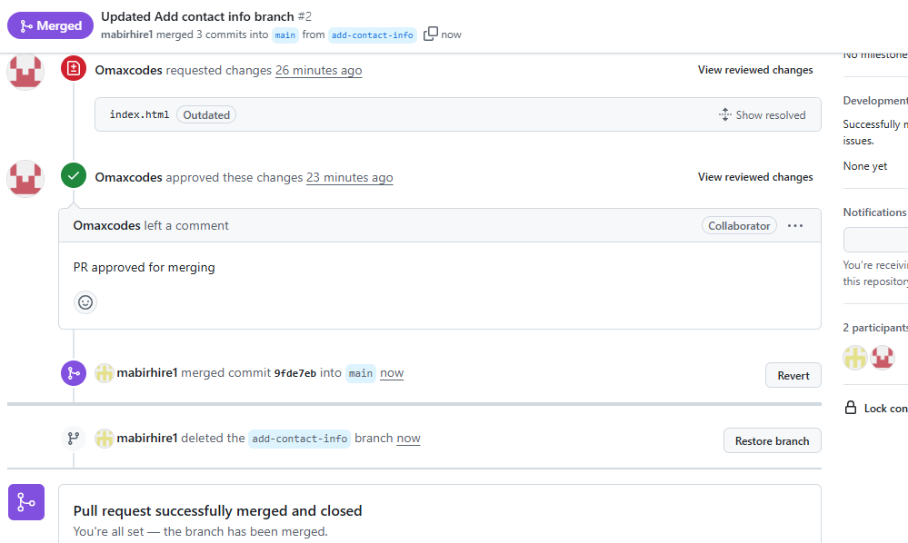

## 15. Verify Final State of Main Branch
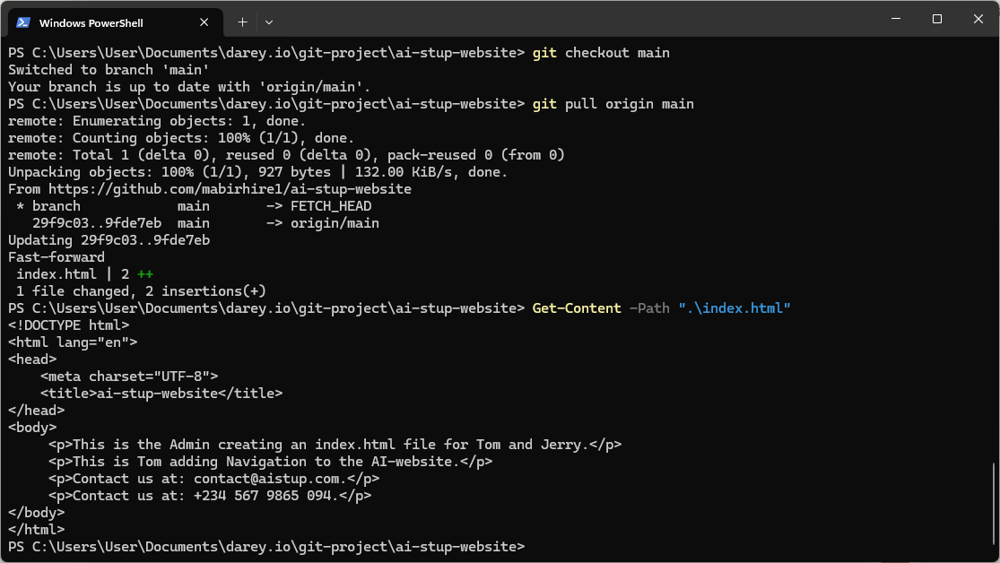

## 16. Repository Structure on GitHub Showing Merged Branches
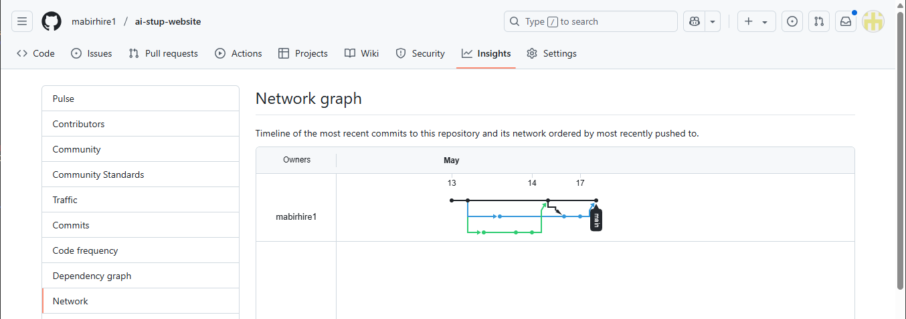

---

## Challenges Faced & Resolutions

| Challenge                         | Description                                                       | Resolution                                                        |
|----------------------------------|-------------------------------------------------------------------|-------------------------------------------------------------------|
| Committing to wrong branch       | Accidentally committed to `add-contact-info` instead of `main`    | Used `git checkout main`, ensured changes were in sync, then pushed correctly |

| Divergent branches error         | Got error while pulling: “need to specify how to reconcile”        | Used `git pull --rebase` to rebase instead of merge              |

| No upstream branch tracking      | Push error when branch wasn’t tracking remote                      | Used `git push --set-upstream origin add-contact-info`           |                    |

| Forgetting to switch branches    | Made edits in `main` by mistake                                    | Used `git stash`, switched to correct branch, then applied stash |
